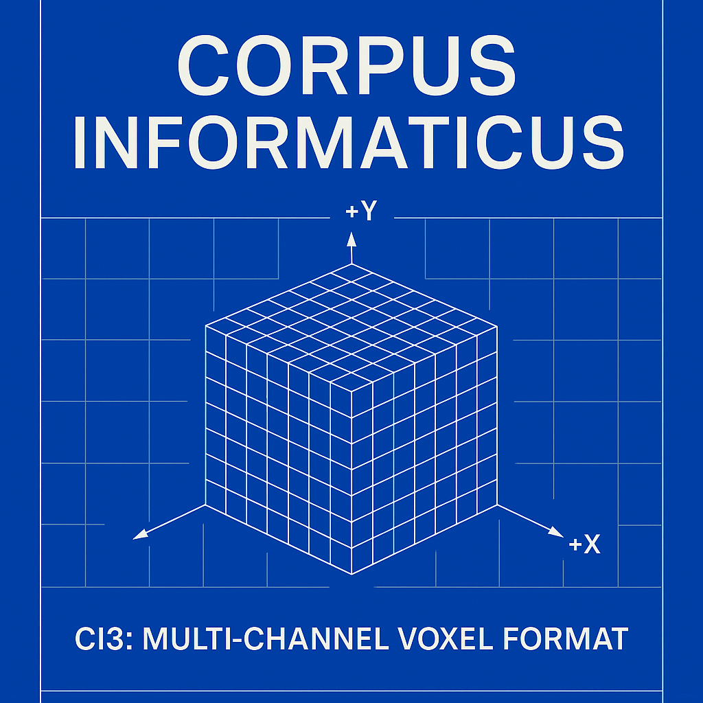

# Corpus Informaticus (CI3)



---

## Overview

Corpus Informaticus is a **volumetric, tensor-native data container** that stores information as a **3D voxel body** instead of a traditional linear byte stream.

This early experimental release provides two reference specifications:

---

## v0.1 — Single-Channel Corpus

- **16 × 16 × 16 lattice** (4096 voxels)
- **1 byte per voxel** (4096-byte capacity)
- **Lossless round-trip** for any file ≤ 4096 bytes
- **CRC32** integrity check over the full volume
- Python examples:
  - Encode & decode (“Hello Corpus”)
  - Arbitrary file → `.ci3` → file
  - 2D voxel slice visualization

---

## v0.2 — Anatomy v1 (Multi-Channel Voxels)


- Same **16 × 16 × 16 geometry**
- **4 channels per voxel**:
  - `payload`   — primary data
  - `integrity` — per-voxel quality (0–255)
  - `semantic`  — semantic tag (0 = unset)
  - `aux`       — experimental / future use
- **CRC32** over all channels
- Examples:
  - Multi-channel encoding
  - Multi-channel decoding
  - Channel slice viewing via NumPy

These channels introduce early support for **3D semantics**, **integrity layers**, and **future multimodal expansion**.

---

## Philosophy

Traditional files are linear.  
Robotics, simulation, and AI perception are not.

CI3 explores **data structures that match how advanced systems think**:

- Volumetric memory  
- Spatially coherent data  
- Multi-channel tensors  
- Integrity gradients  
- Semantic regions  

This is a research-driven, open, extensible format — intended to grow in public.

---

## Getting Started

### Clone the repo

```bash
git clone https://github.com/IoTIVP/corpus-informaticus.git
cd corpus-informaticus
pip install matplotlib numpy
```

---

## v0.1 Examples

### Encode a demo corpus

```bash
python examples/hello_corpus/encode_hello.py
```

### Decode it

```bash
python examples/hello_corpus/decode_hello.py
```

### Visualize a slice

```bash
python examples/hello_corpus/view_slice.py
```

### File Round-Trip

```bash
echo "This is a test file for Corpus Informaticus." > examples/file_roundtrip/sample.txt
python examples/file_roundtrip/file_to_ci3.py examples/file_roundtrip/sample.txt
python examples/file_roundtrip/ci3_to_file.py examples/file_roundtrip/sample.txt.ci3
```

---

## v0.2 Examples (Multi-Channel)

```bash
python examples/v02/encode_v02.py
python examples/v02/decode_v02.py
python examples/v02/view_slice.py
```

---

## High-Level Roadmap

### **v0.3 — Integrity Structures**
- Use integrity channel to encode per-voxel confidence
- Plane-based parity / anomaly detection
- Integrity heatmap visualization

### **v0.4 — Semantic Layers**
- Use semantic + aux to label 3D regions
- Modality zones, timestamps, sensor class mapping
- Basis for voxel-native multi-modal fusion

### **v1.0 — Stable Spec + Bindings**
- Finalized `.ci3` file format  
- Python package (`pip install corpus-informaticus`)  
- Optional robotics/simulation bindings:
  - ROS2
  - NVIDIA Isaac Sim
  - Unity / Omniverse

---

## Contributing

Corpus Informaticus is **open experimental research**.  
Issues, discussions, and contributions are welcome.

---

## License

MIT License.
